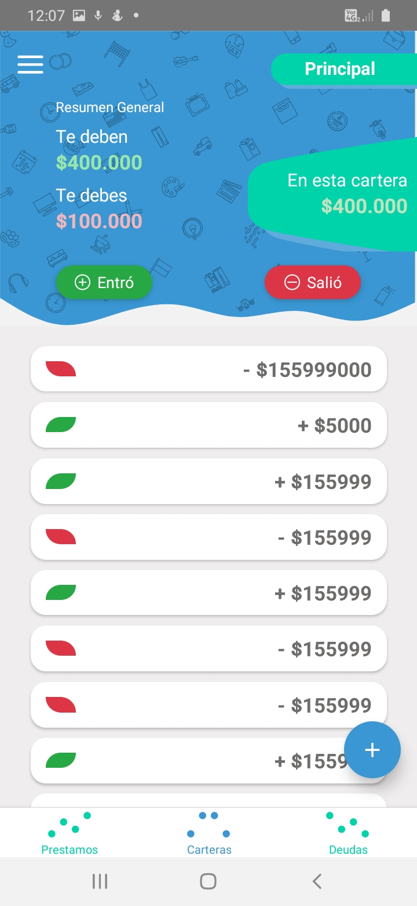
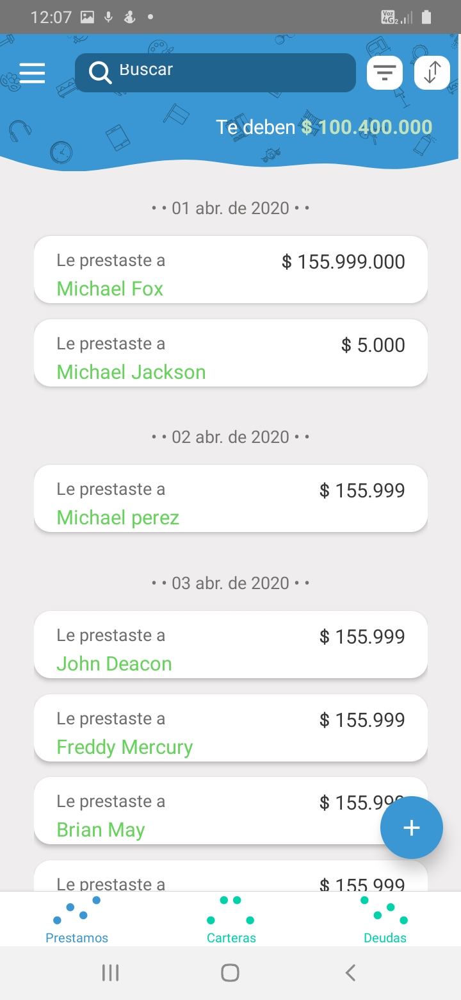

<p align="center">
 
</p>

# Capis

Lleva el control de tu dinero!


✓ Ten una lista de lo que prestas y lo que debes.

✓ Puedes tener diferentes carteras.

✓ Controla lo que entra y lo que sale de tus carteras.


Caplist es una app desarrollada en React native que tiene como función principal ayudar a llevar un control de el dinero que prestas y el que te prestan por medio de listas. Adicionalmente puedes tener diferentes carteras y registrar todos los movimientos (dinero que entra y sale) de esta.


## Capturas  🖼️

<p align="center">
 
 
 
 
</p>

## Construido con 🛠️

* [React Native ](http://https://reactnative.dev/) 
* [Firebase](https://firebase.google.com/)
* [React Navigation](https://reactnavigation.org/)
* [Redux](https://redux.js.org/)


### run

Recuerda primero que todo instalar las dependencias.

```sh
$ npm install -d
```

Ahora ya puedes ejecutar el proyecto. 

```
Para android...
$ npm run android

Para ios...
$ npm run ios
```
